# pp-dev feature tour

A visual walkthrough of everything pp-dev injects into a served Portal Page during development —
the dev panel, the Request Inspector, and the Variables Editor. See the root [README](../README.md)
for configuration details; this doc is the "what does it actually look like" companion.

All screenshots below were taken against a real Metric Insights instance, with the panel's
**Auto** theme in most shots (it follows your OS/browser preference) unless noted otherwise.

## Dev Panel

Injected into every served page. Shows the package version, backend URL, template mode, and App
ID, and hosts the **Sync** button plus quick actions for page variables and dev tools.

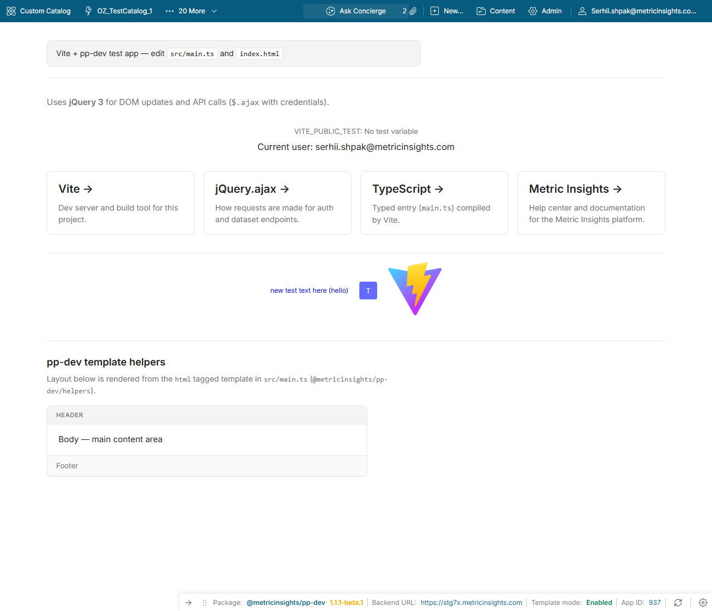

Minimizing (the arrow on the panel's edge) slides it down to a small peeking arrow in the
anchored corner — click it again to bring the panel back:

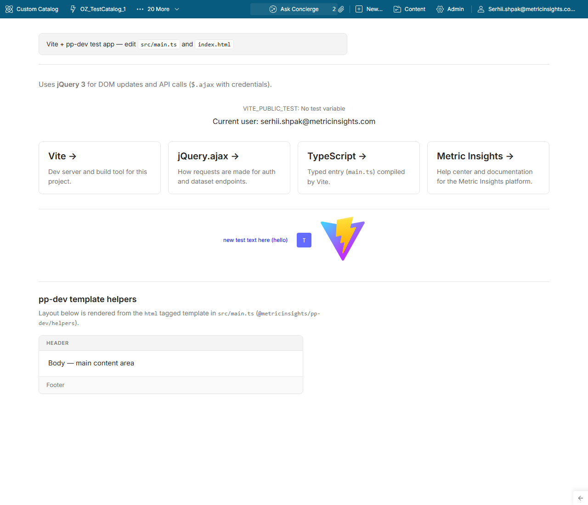

The gear icon opens the settings popover: corner position, auto-hide, an **Auto / Dark / Light**
theme switcher, page-variable actions ("Reload variables", "Open variables editor…"), "Open
request inspector…", and hide/reset:

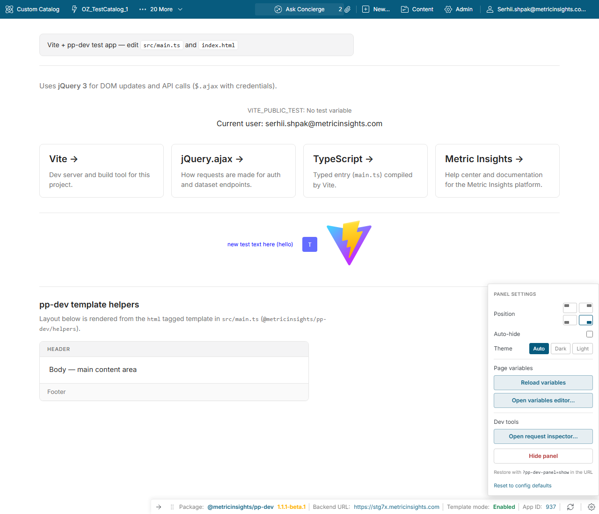

See the README's [Dev Panel](../README.md#dev-panel) section for the position/auto-hide/hide
behavior in detail, and [Page variables](../README.md#page-variables) for what the "Reload
variables" and "Open variables editor…" buttons do.

## Request Inspector

A standalone page (`/@pp-dev/inspector`) that captures every proxied and locally-served HTTP
request made during development — no config needed, enabled by default.

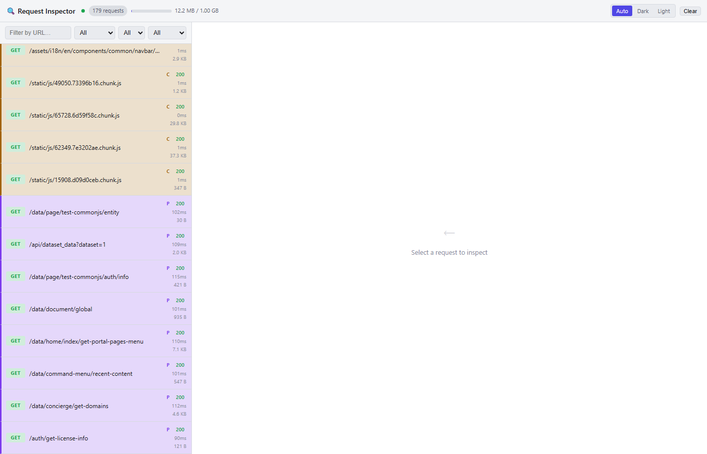

Each request in the list carries a color-coded left border and letter badge for where it was
served from — proxied to MI (purple `P`), served from the local proxy cache (amber `C`), or
served locally (grey `L`). Selecting one opens the detail pane: full request/response headers
(with a **Copy** button per section) and the body, syntax-highlighted for JSON:

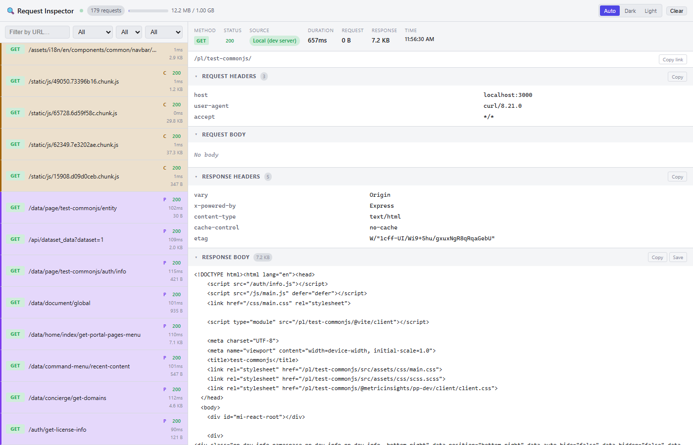

See the README's [Request Inspector](../README.md#request-inspector) section for the REST API
(`/@api/requests`) and configuration options (`maxMemory`, `captureLimit`).

## Variables Editor

A standalone page (`/@pp-dev/variables-editor`) for editing a template's variable schema and a
page's live variable values, without hand-editing JSON or going through Metric Insights' own
editor.

### Schema tab

Edit `__template_variables.json` directly — add/remove variables, change type, default value,
description, and the editor flags MI's own form exposes per type. Expanding a row's **⚙**
reveals the advanced fields (`uid`, `tag_source`, `additional_options`, editor-flag checkboxes):

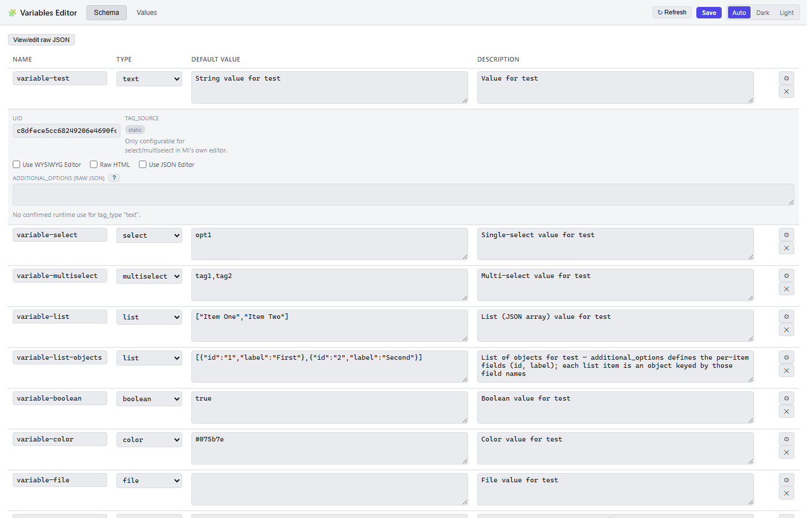

The **?** next to `additional_options` opens a modal explaining exactly what's expected for that
row's current type/source — reverse-engineered from MI's own create-variable form and its
options-loading endpoint (see [`TEMPLATE_VARIABLES.md`](../TEMPLATE_VARIABLES.md) for the written
version):

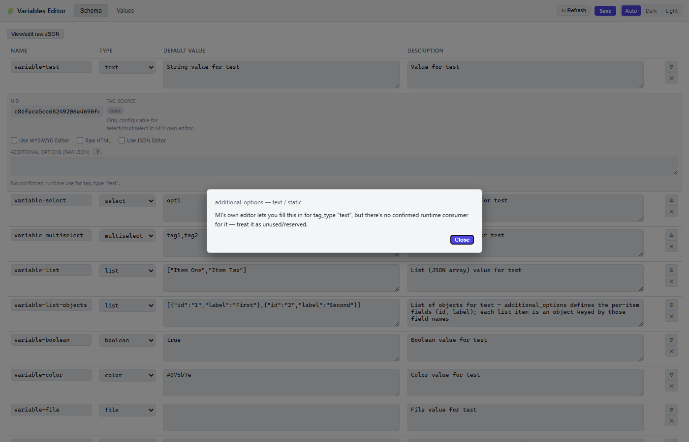

### Values tab

Edit the page's live variable values in place, with a widget per type: a searchable combobox for
`select`/`multiselect` with static options, a per-item form for `list` (flat or column-defined
objects), a checkbox for `boolean`, a color picker, and so on:

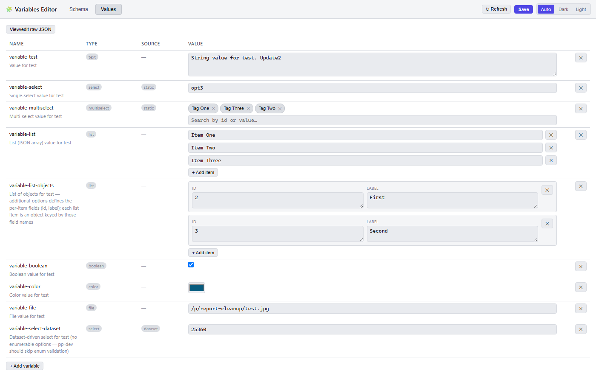

**View/edit raw JSON** switches to a JSON view of the same data — list-type values shown as
native arrays instead of double-escaped strings — with **Save to JSON file…** / **Import from
JSON file…** buttons and inline warnings for values that don't match a declared option, changed
since the tab was last loaded, or aren't in the schema:

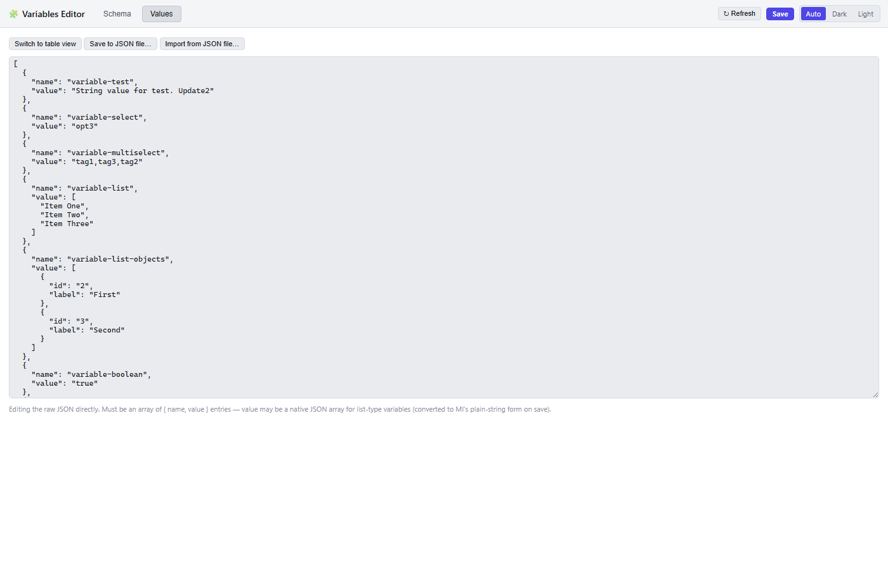

### Theme switcher

The dev panel's settings popover (see [Dev Panel](#dev-panel) above) is where you'd normally set
this, but the Inspector and Variables Editor also have their own **Auto / Dark / Light** switcher
in the toolbar for when either is opened directly. "Auto" follows the OS/browser preference; the
other two set an explicit override, persisted in `localStorage` and shared across all three
surfaces — pick a theme in the panel and it carries over to the standalone pages, and vice versa:

<table>
<tr><td>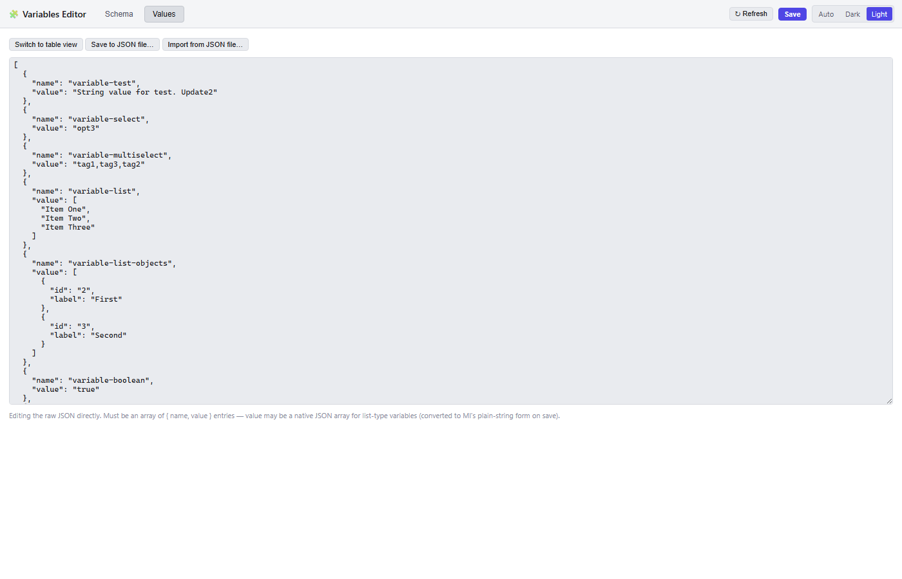</td>
<td>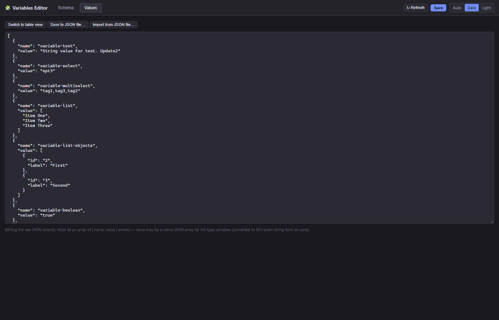</td></tr>
</table>

Both the active tab and the Values tab's JSON mode are reflected in the URL
(`?tab=values&mode=json`), so a specific view can be bookmarked or shared.
